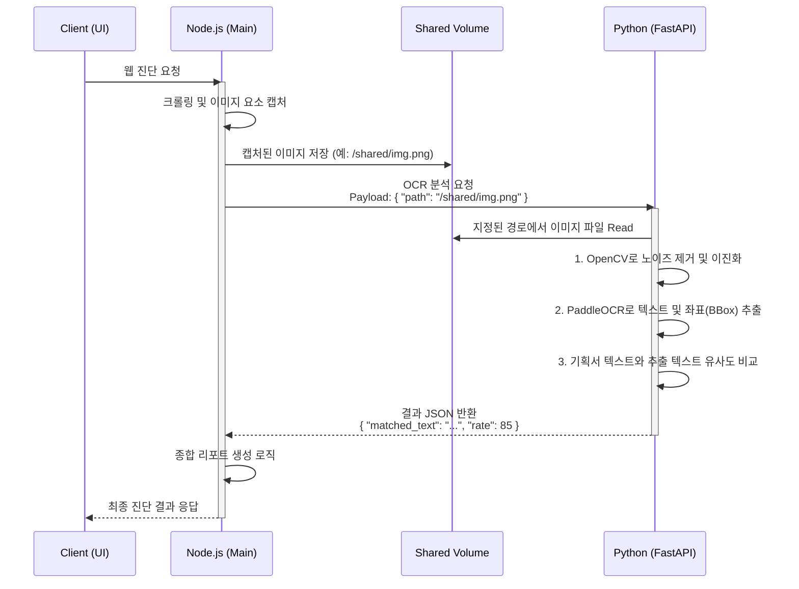

# OCR 고도화를 위한 마이크로서비스 도입 및 수정 개발 계획

## 1. 아키텍처 변경 개요
*   **기존 구조**: Node.js 단일 환경에서의 OCR 처리 시도 (성능, 지원 라이브러리, 인식률의 한계)
*   **변경 구조**: Node.js (메인 비즈니스 서버) + Python/FastAPI (OCR 전용 분석 마이크로서비스) 하이브리드 구조

## 1.1 시스템 아키텍처 및 워크플로우 도식화

### 🏗️ 시스템 아키텍처 (Architecture)
무거운 AI 분석 엔진을 메인 서버에서 분리하여 안정성과 독립성을 확보합니다.

```mermaid
graph TD
    subgraph "Node.js 메인 환경 (기존)"
        A[Next.js UI] -->|REST API| B(Node.js Backend)
        B -->|웹 스크랩핑| C[Puppeteer/Playwright]
    end

    subgraph "Shared Storage (공유 볼륨)"
        D[(수집된 이미지 파일들)]
    end

    subgraph "Python 마이크로서비스 (신규 도입)"
        E[FastAPI API Server]
        F[OpenCV 전처리 모듈]
        G[PaddleOCR AI 엔진]
        H[유사도 매칭 모듈 (Fuzzy)]
        
        E --> F
        F --> G
        G --> H
    end

    C -.->|물리적 파일 저장| D
    B == "1. API 요청 (이미지 경로만 전달)" ==> E
    E -.->|물리적 파일 로드| D
    H == "2. 분석 결과 반환 (JSON)" ==> B
```

### 🔄 처리 워크플로우 (Sequence Flow)
가장 비효율적인 이미지 Base64 인코딩 과정을 제거하고, 물리적 파일 경로를 전달하여 오버헤드를 극적으로 줄인 실무형 최적화 파이프라인입니다.



## 2. 주요 기술 스택
*   **메인 서버 (유지)**: Node.js / Next.js
*   **마이크로서비스**: Python 3.10+, FastAPI, Uvicorn
*   **AI 및 분석 엔진**: PaddleOCR (PP-OCRv4), OpenCV (전처리), FuzzyWuzzy 또는 python-Levenshtein (유사도 매칭)
*   **인프라**: Docker 및 Docker Compose (컨테이너 간 볼륨 공유 및 네트워킹)

## 3. 실무 최적화 설계 포인트 (핵심 적용)
1.  **네트워크 페이로드 최적화 (Base64 지양)**
    *   이미지를 Base64로 인코딩하여 REST API로 전송하지 않습니다 (용량 30% 증가 및 오버헤드 발생).
    *   **해결책**: 메인 서버가 다운로드한 이미지의 **물리적 파일 경로(공유 볼륨 사용)**를 Python API로 전달하거나, 접근 가능한 **원본 URL을 전달**하여 Python 서버가 직접 읽도록 설계합니다.
2.  **비동기 처리 및 폴링(Polling) 구조**
    *   대량의 웹 페이지 크롤링 시 OCR 분석이 병목이 되어 API Timeout이 발생할 수 있습니다.
    *   **해결책**: 메인 서버는 분석 요청(Job)만 던지고 `job_id`를 반환받습니다. 이후 주기적으로 상태를 Polling 하거나, 분석 완료 시 FastAPI가 메인 서버의 Webhook URL로 결과를 쏴주는 비동기 아키텍처를 도입합니다.
3.  **컨테이너 및 모델 경량화 (ONNX 최적화 검토)**
    *   초기에는 안정성이 검증된 순정 PaddleOCR 프레임워크로 구현합니다.
    *   추후 CPU 환경 최적화 및 도커 이미지 다이어트가 필요할 경우, Paddle 모델을 **ONNX로 변환**하여 의존성을 대폭 줄이는 2차 최적화를 진행합니다.

## 4. 단계별 개발 계획 (Implementation Phases)

### Phase 1: Python 분석 마이크로서비스 기반 구축 (1주차)
*   [ ] Python/FastAPI 프로젝트 초기화 및 Dockerfile 설정
*   [ ] PaddleOCR 라이브러리 적용 및 한국어/영어 혼용 모델 로드
*   [ ] 단일 이미지에 대한 텍스트 추출 테스트 스크립트 작성
*   [ ] `/api/v1/ocr/analyze` 기본 엔드포인트 구현 (요청 수신 -> OCR 구동 -> 텍스트 및 Bounding Box JSON 반환)

### Phase 2: 전처리 로직 및 텍스트 매칭 고도화 (2주차)
*   [ ] **이미지 전처리**: OpenCV를 활용하여 노이즈 제거, 해상도 업스케일, 대비 조절 등 인식률 상향을 위한 필터 로직 추가
*   [ ] **텍스트 유사도 평가**: Fuzzy Matching 알고리즘을 적용하여, OCR로 추출된 텍스트와 기획서/기준 텍스트 간의 N-gram, 형태소 기반 매칭률 측정 기능 개발
*   [ ] JSON 응답 데이터 고도화: 단순 텍스트뿐만 아니라 `매칭률(%)`, `의미 있는 텍스트 여부(장식용 텍스트 필터링)` 포함

### Phase 3: Node.js 메인 서버 연동 및 비동기 파이프라인 (3주차)
*   [ ] Node.js에서 기존 OCR 관련 종속성/로직 제거
*   [ ] Node.js <-> FastAPI 간의 통신 클라이언트(Axios/Fetch) 구현
*   [ ] `docker-compose.yml`을 구성하여 Node.js 컨테이너와 FastAPI 컨테이너 간의 네트워크 및 스토리지(공유 볼륨) 연동
*   [ ] Timeout 방지를 위한 비동기 상태 폴링(Polling) 로직 메인 서버에 탑재

### Phase 4: 벤치마크 테스트 및 최적화 (4주차)
*   [ ] 실제 진단 타겟 사이트(웹 배너, 팝업, 특수 폰트 적용 영역) 데이터셋 100~500건 추출 및 벤치마크 테스트
*   [ ] 기존 35% 매칭률 대비 **75~85% 이상 목표 달성률 검증**
*   [ ] CPU/Memory 부하 테스트 및 멀티 워커(Uvicorn workers) 튜닝
*   [ ] 필요 시 ONNX 런타임 전환 검토

## 5. 기대 효과
1.  **압도적인 인식률 개선**: PaddleOCR + 전처리/Fuzzy 매칭 결합을 통해 복잡한 배너 이미지 내 텍스트 매칭률을 극적으로 향상
2.  **안정성 및 결합도 완화(Decoupling)**: 무거운 AI 추론 작업을 메인 서비스와 분리하여 Node.js 웹/API 서비스의 무중단 안정성 확보
3.  **확장 가능한 AI 인프라 마련**: 향후 이미지 대체 텍스트 자동 생성(LLaVA 등)이나 색상 대비 진단 같은 비전(Vision) AI 모델을 손쉽게 추가할 수 있는 마이크로서비스 토대 구축
